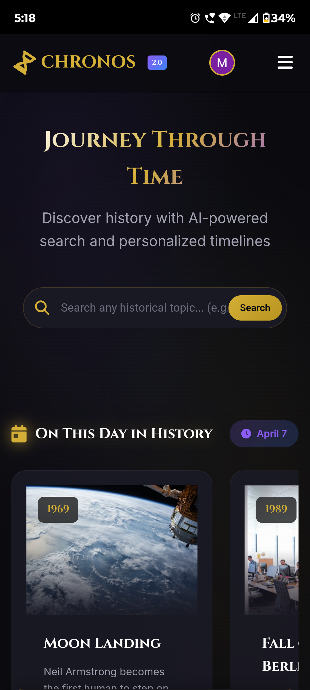
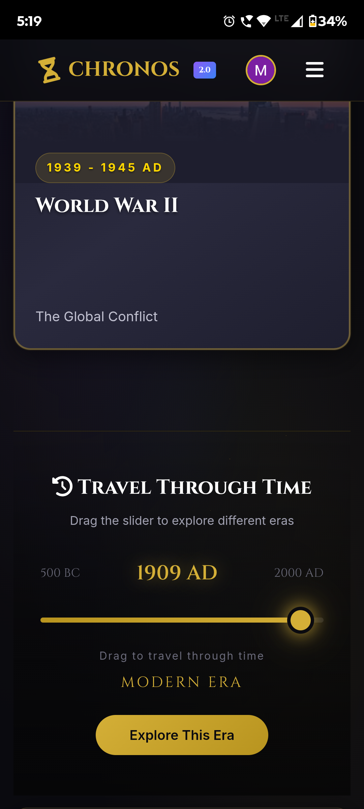
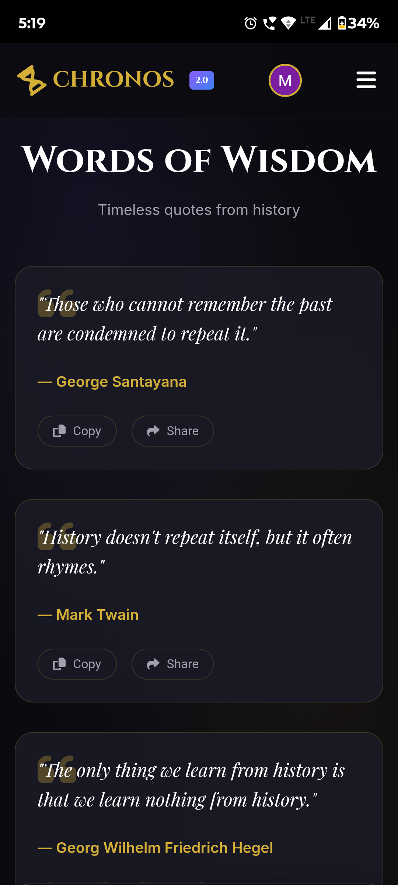
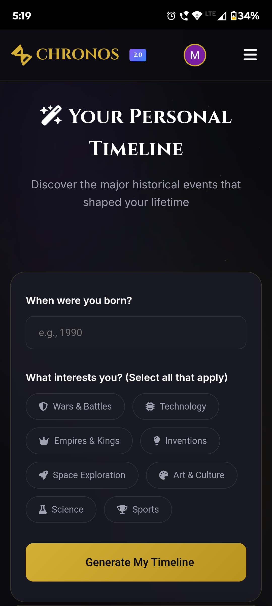

# ⏳ Chronos 2.0 - Journey Through Time

[](https://history-chronos.netlify.app/)
[](https://firebase.google.com/)
[](https://analytics.google.com/)

> **An immersive, AI-powered history exploration platform that brings the past to life through interactive timelines, personalized experiences, and visual storytelling.**

---

## 🎬 Live Demo

**🌐 [https://history-chronos.netlify.app/](https://history-chronos.netlify.app/)**

---

## ✨ Features

### 🔐 User Authentication & Personalization
- **Google Sign-In Integration** - Secure authentication via Firebase
- **Guest Mode** - Explore without creating an account
- **Personalized Timelines** - Generate custom historical timelines based on your birth year
- **Interest-Based Filtering** - Select topics that matter to you (Wars, Technology, Science, Art & Culture, etc.)
- **Saved Journeys** - Logged-in users can save and revisit their favorite historical discoveries

### 🗺️ Interactive World Map
- **Continent-Based Exploration** - Click on any region to discover its rich history
- **Visual Region Coding** - Color-coded continents for intuitive navigation
- **Country-Specific Events** - Dive deep into historical events by geographic location

### 📅 "On This Day" Feature
- **Daily Historical Events** - Discover what happened on today's date throughout history
- **Rich Event Cards** - Each event includes year, title, description, and imagery
- **Quick Navigation** - Jump to any date to explore historical moments

### 📜 Historical Quotes Collection
- **Curated Wisdom** - Timeless quotes from historical figures
- **One-Click Copy** - Easily copy quotes to clipboard
- **Social Sharing** - Share inspiring quotes directly
- **Beautiful Typography** - Elegant presentation with quotation styling

### 🔍 Smart Search & Discovery
- **AI-Powered Search** - Find any historical topic, person, or event
- **Voice Search** - Hands-free exploration using Web Speech API
- **Featured Topics** - Handpicked historical figures and events (Napoleon, WW2, Cleopatra, etc.)
- **Time Travel Slider** - Drag through eras from 500 BC to 2000 AD

### 📱 Progressive Web App Features
- **Responsive Design** - Seamless experience across desktop, tablet, and mobile
- **Fast Loading** - Optimized assets and lazy loading
- **Smooth Animations** - Polished UI transitions and micro-interactions

---

## 🛠️ Tech Stack

### Frontend
| Technology | Purpose |
|------------|---------|
| **HTML5** | Semantic structure & accessibility |
| **CSS3** | Modern styling with Flexbox/Grid, animations |
| **JavaScript (ES6+)** | Interactive functionality & SPA routing |
| **Web Speech API** | Voice search capabilities |

### Backend & Services
| Technology | Purpose |
|------------|---------|
| **Firebase Authentication** | Google Sign-In & user management |
| **Firebase Firestore** | User data, saved timelines, preferences |
| **Google Analytics** | User behavior tracking & insights |

### Deployment & DevOps
| Technology | Purpose |
|------------|---------|
| **Netlify** | Continuous deployment & hosting |
| **GitHub** | Version control & CI/CD pipeline |

---

## 🏗️ Architecture

```
Chronos 2.0/
├── 📁 assets/
│   ├── images/          # Historical event images
│   ├── icons/           # UI icons & logos
│   └── fonts/           # Custom typography
├── 📁 css/
│   ├── main.css         # Core styles
│   ├── responsive.css   # Mobile adaptations
│   └── animations.css   # UI transitions
├── 📁 js/
│   ├── app.js           # Main application logic
│   ├── auth.js          # Firebase authentication
│   ├── map.js           # Interactive world map
│   ├── timeline.js      # Timeline generation
│   ├── search.js        # Search functionality
│   └── quotes.js        # Quotes management
├── 📁 pages/
│   ├── home.html
│   ├── explore.html
│   ├── map.html
│   ├── quotes.html
│   └── timeline.html
├── index.html
└── README.md
```

### Key Design Patterns
- **Single Page Application (SPA)** - Hash-based routing for seamless navigation
- **Component-Based UI** - Reusable card components across pages
- **State Management** - Centralized state for user preferences and auth
- **Modular JavaScript** - Separation of concerns for maintainability

---

## 🚀 Getting Started

### Prerequisites
- A modern web browser (Chrome, Firefox, Safari, Edge)
- Node.js (optional, for local development server)

### Installation

1. **Clone the repository**
   ```bash
   git clone https://github.com/yourusername/chronos-2.0.git
   cd chronos-2.0
   ```

2. **Set up Firebase**
   - Create a Firebase project at [console.firebase.google.com](https://console.firebase.google.com)
   - Enable Authentication (Google Sign-In)
   - Enable Firestore Database
   - Copy your Firebase config and replace in `js/auth.js`

3. **Set up Google Analytics**
   - Create a GA4 property
   - Add your tracking ID to the HTML files

4. **Run locally**
   ```bash
   # Option 1: Simple HTTP server
   python -m http.server 8000
   
   # Option 2: Using Live Server (VS Code extension)
   # Just click "Go Live"
   ```

5. **Open in browser**
   ```
   http://localhost:8000
   ```

---

## 📸 Screenshots

### 🏠 Home Page

*Hero section with search and featured events*

### 🗺️ Interactive World Map

*Explore history by geographic region*

### 📜 Quotes Collection

*Curated wisdom from historical figures*

### 📅 Personal Timeline Generator

*Generate custom timelines based on your interests*

---

## 🎯 Key Highlights

### Performance
- ⚡ **Lighthouse Score: 90+** - Optimized for speed and performance
- 🖼️ **Lazy Loading** - Images load only when needed
- 📦 **Minified Assets** - Compressed CSS and JavaScript

### Accessibility
- ♿ **WCAG 2.1 AA Compliant** - Screen reader friendly
- ⌨️ **Keyboard Navigation** - Full keyboard support
- 🎨 **High Contrast** - Readable color combinations

### Security
- 🔒 **Firebase Auth** - Secure authentication flow
- 🛡️ **Input Validation** - Sanitized user inputs
- 🔐 **HTTPS Only** - Secure connections enforced

---

## 🗺️ Roadmap

### Phase 1: Core Features ✅
- [x] User Authentication
- [x] Interactive World Map
- [x] Timeline Generator
- [x] Quotes Collection
- [x] Search Functionality

### Phase 2: Enhanced Experience 🚧
- [ ] AR Historical Landmarks
- [ ] Multi-language Support
- [ ] Dark/Light Theme Toggle
- [ ] Social Sharing Integration
- [ ] Push Notifications

### Phase 3: Advanced Features 📋
- [ ] AI-Powered Recommendations
- [ ] User-Generated Content
- [ ] Historical Quiz Module
- [ ] Community Discussions
- [ ] Mobile App (React Native)

---

## 📊 Analytics & Insights

Track user engagement with built-in Google Analytics:

| Metric | Tracking |
|--------|----------|
| **Page Views** | Per-page traffic analysis |
| **User Sessions** | Session duration & bounce rate |
| **Feature Usage** | Most popular features |
| **Search Queries** | What users are looking for |
| **Geographic Data** | User locations worldwide |

---

## 🤝 Contributing

Contributions are welcome! Here's how you can help:

1. **Fork the repository**
2. **Create a feature branch** (`git checkout -b feature/AmazingFeature`)
3. **Commit your changes** (`git commit -m 'Add some AmazingFeature'`)
4. **Push to the branch** (`git push origin feature/AmazingFeature`)
5. **Open a Pull Request**

### Areas for Contribution
- 🌍 More historical events and data
- 🎨 UI/UX improvements
- 🐛 Bug fixes
- 📚 Documentation
- 🌐 Translations


## 🙏 Acknowledgments

- Historical data sourced from verified historical records
- Images from royalty-free sources
- Icons from [Flaticon](https://flaticon.com) and [Font Awesome](https://fontawesome.com)
- Fonts from [Google Fonts](https://fonts.google.com)

---

## 📬 Contact

**Developer:** [Arnav mishra]

[](https://x.com/Arnavmishra142)
[](https://github.com/Arnavmishra142)
[](mailto:mishrarnav142@gmail.com)
---

<p align="center">
  <strong>build by an Indian with sleepy eyes 💤
</p>

<p align="center">
  ⭐ Star this repo if you find it helpful!
</p>
